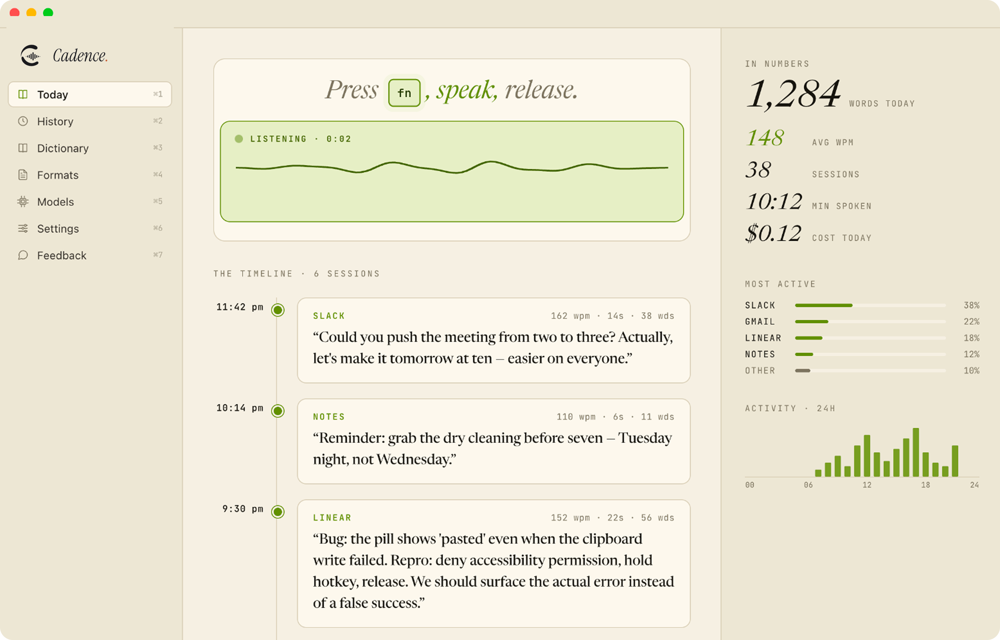

<p align="center">
  <picture>
    <source media="(prefers-color-scheme: dark)" srcset="media/cadence-logo-full-dark.png">
    <source media="(prefers-color-scheme: light)" srcset="media/cadence-logo-full-light.png">
    
  </picture>
</p>

<p align="center">
  <strong>Local-first AI voice dictation & text transformation for macOS, Windows, and Linux.</strong>
</p>

<p align="center">
  <a href="https://github.com/rishabh777dev/cadence"></a>
  <a href="https://github.com/rishabh777dev/cadence/releases"></a>
  
  <a href="LICENSE"></a>
</p>

---

**Cadence** is a lightning-fast voice dictation and text-refinement desktop application. Hold down a hotkey, speak naturally, and clean, punctuated text instantly pastes wherever your cursor is. 

Speak 4X faster than you type — with complete privacy, local-first processing, and seamless multi-model intelligence.

<p align="center">
  
</p>

---

## ✨ Features

- 🎙️ **Voice Dictation** — Hold your hotkey, speak, and release. Fast audio processing transcribes and pastes into any application in milliseconds.
- ✨ **Magic Edit** — Highlight any text anywhere, hold your hotkey, give spoken instructions (e.g. *"make this bullet points"* or *"translate to Spanish"*), and watch it rewrite in-place.
- 🔒 **Local-First & Private** — Run embedded Whisper (`whisper.cpp`) or Apple MLX local models directly on your hardware. Your voice and transcripts never leave your machine.
- ⚡ **Bring Your Own Cloud Model** — Connect your preferred cloud API keys when desired: OpenAI, Groq, Anthropic, Google Gemini, Deepgram, and ElevenLabs.
- 🧹 **Intelligent Post-Processing** — Automatically strips verbal filler (*"um"*, *"ah"*, *"like"*) and applies context-aware grammar, casing, and punctuation cleanup.
- 📖 **Custom Dictionary & Tone Tuning** — Define custom word replacements (e.g. `"type script"` → `TypeScript`) and set app-specific tones (e.g. Code style for VS Code, Casual for Slack).
- 🧩 **Extensible Plugin Ecosystem** — Customize your pipeline with first-party and community plugins via the Cadence Voice Plugin SDK.

---

## ⌨️ Default Shortcuts

| Action | Shortcut | Description |
|---|---|---|
| **Voice Dictation** | `Control + Space` | Hold to speak, release to paste transcription |
| **Magic Edit** | `Alt + X` | Select text, hold and speak instructions to edit |
| **Cancel Dictation** | `Escape` | Cancel the current listening / transcription session |

*All shortcuts can be customized in the **Settings** tab.*

---

## 📥 Download & Installation

| Platform | Architecture | Package |
|---|---|---|
| **Windows** | x64 | [`.exe Installer`](https://github.com/rishabh777dev/cadence/releases/latest) |
| **macOS** | Apple Silicon (M-series) | [`.dmg (arm64)`](https://github.com/rishabh777dev/cadence/releases/latest) |
| **macOS** | Intel | [`.dmg (x64)`](https://github.com/rishabh777dev/cadence/releases/latest) |
| **Linux** | x64 | [`.AppImage`](https://github.com/rishabh777dev/cadence/releases/latest) / [`.deb`](https://github.com/rishabh777dev/cadence/releases/latest) |

---

## 🛠️ Quick Start for Developers

```bash
# 1. Clone the repository
git clone https://github.com/rishabh777dev/cadence.git
cd cadence

# 2. Install dependencies
pnpm install

# 3. Start development mode with hot-reload
pnpm dev
```

For building packages, contributing guidelines, and architecture details, see [**CONTRIBUTING.md**](CONTRIBUTING.md).

---

## 🤝 Contributing & Issues

- 🐛 **Issues & Feedback**: Report bugs or suggest features on [GitHub Issues](https://github.com/rishabh777dev/cadence/issues).
- 💡 **Discussions**: Start a discussion on [GitHub Discussions](https://github.com/rishabh777dev/cadence/discussions).

---

## 📄 License

Distributed under the [MIT License](LICENSE).